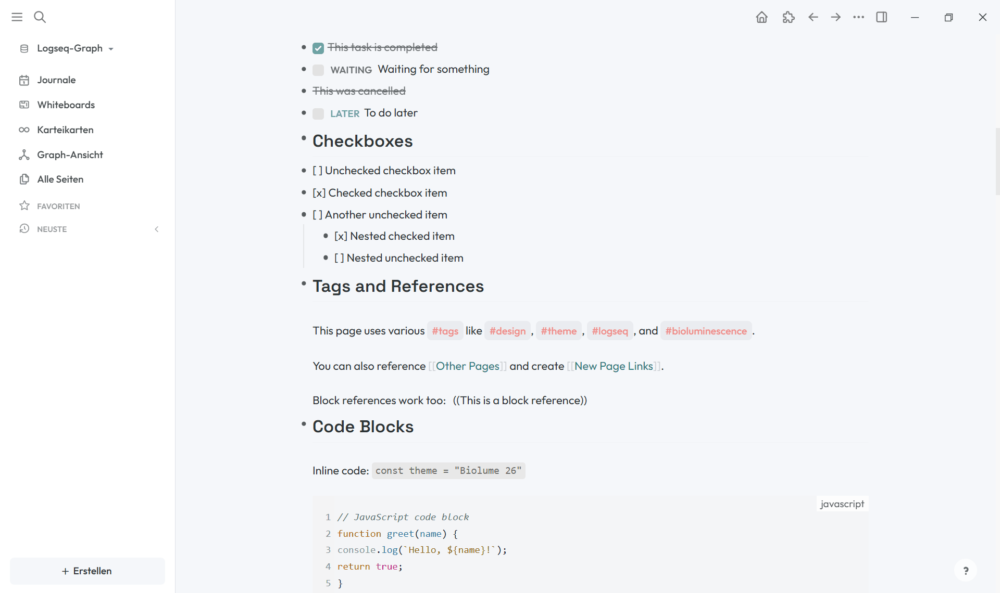
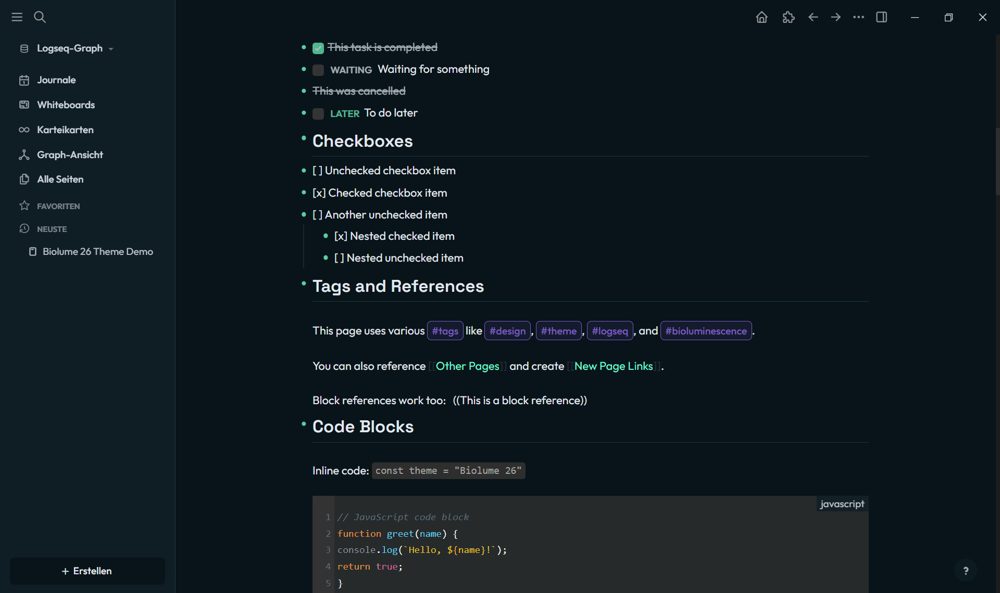

# Biolume 26 Theme

A hip and stylish Logseq theme designed for 2026, blending **Digital Flora** aesthetics with **Electric Bioluminescence** to create a workspace that feels both organic and futuristic.

## ✨ Features

### 🎨 Two Beautiful Modes

- **Light Mode ("Cloud Dancer")**: A soft, calming palette with Deep Teal (#008080) and Coral (#FF6B6B) accents on a Cloud Dancer (#F5F7FA) background
- **Dark Mode ("Midnight Biolume")**: A deep, immersive dark mode with Neo-Mint (#00FFC2) and Electric Violet (#9D65FF) neon accents with bioluminescent glow effects

### 🔤 Premium Typography

- **Headings**: [Space Grotesk](https://fonts.google.com/specimen/Space+Grotesk) - Tech-inspired, weird but legible
- **Body Text**: [Outfit](https://fonts.google.com/specimen/Outfit) - Clean, modern geometry

### 🌟 Design Highlights

- **Glowing bullet points** in dark mode that light up on hover
- **Neon-bordered tags** with hover animations
- **Themed code blocks** with a matching syntax palette
- **Colored task markers** (TODO/LATER, NOW/DOING, WAITING)
- **Accent details**: text selection, scrollbars, highlights, quotes, active block
- **Readable contrasts** in light mode and respect for `prefers-reduced-motion`

### 🎛️ Customizing

All design decisions are exposed as `--biolume-*` variables (radius, glow, tag and code colors).
Override them in your `logseq/custom.css`, e.g.:

```css
html[data-theme='dark'] {
  --biolume-radius: 10px;
  --biolume-glow-strong: 0 0 16px #00FFC2;
}
```

## 📦 Installation

### Via Logseq Marketplace (Recommended)

1. Open Logseq
2. Go to `Settings` → `Themes`
3. Click on `Marketplace`
4. Search for "Biolume 26"
5. Click `Install`
6. Select either "Biolume 26 Light" or "Biolume 26 Dark" from the theme dropdown

### Manual Installation

1. Download the latest release from the [Releases page](https://github.com/martinmoeller/logseq-biolume-26-theme/releases)
2. Extract the zip file
3. In Logseq, go to `Settings` → `Plugins`
4. Enable `Developer Mode`
5. Click `Load unpacked plugin`
6. Select the extracted folder
7. Choose your preferred mode in `Settings` → `Themes`

### Advanced: Custom CSS

For advanced users who want to customize:

1. Copy the contents of `theme-light.css` or `theme-dark.css`
2. Paste into your `logseq/custom.css` file
3. Modify as desired

## 🎨 Color Palette

### Light Mode
- **Primary**: Deep Teal (#008080)
- **Secondary**: Coral (#FF6B6B)
- **Background**: Cloud Dancer (#F5F7FA)
- **Text**: Charcoal (#2D3436)

### Dark Mode
- **Primary**: Neo-Mint (#00FFC2)
- **Secondary**: Electric Violet (#9D65FF)
- **Background**: Midnight Teal (#051419)
- **Text**: Slate (#E2E8F0)

## 📸 Screenshots

### Light Mode - "Cloud Dancer"


### Dark Mode - "Midnight Biolume"


The screenshots showcase the theme's key features including typography hierarchy, syntax highlighting, task management, tags, and the distinctive color palette in both modes.

## 🤝 Contributing

Contributions, issues, and feature requests are welcome! Feel free to check the [issues page](https://github.com/martinmoeller/logseq-biolume-26-theme/issues).

## 📝 License

Copyright © 2026 [Martin Möller](mailto:moellervdm@gmail.com)

This project is [MIT](./LICENSE) licensed.

## 💖 Support

If you like this theme, please consider:
- ⭐ Starring the repository
- 🐛 Reporting bugs
- 💡 Suggesting new features
- 🔀 Contributing improvements

## 🔗 Links

- [Logseq](https://logseq.com/)
- [Report an Issue](https://github.com/martinmoeller/logseq-biolume-26-theme/issues)
- [View Releases](https://github.com/martinmoeller/logseq-biolume-26-theme/releases)

---

Made with 💚 for the Logseq community
