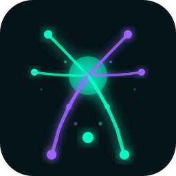

# Biolume 26 Theme - Feature Showcase

## Typography Hierarchy

### This is a Level 3 Heading
#### This is a Level 4 Heading
##### This is a Level 5 Heading

Regular paragraph text with **bold text**, *italic text*, and ***bold italic text***. You can also use ~~strikethrough~~ and ==highlighted text==.

## Lists and Bullets

- This is a top-level bullet point
	- This is a nested bullet
		- This is deeply nested
			- Fourth level nesting
	- Back to second level
- Another top-level item
	- With some nested content
	- And more nested items

1. Numbered list item one
2. Numbered list item two
	1. Nested numbered item
	2. Another nested item
3. Back to top level

## Task Management

- TODO This is an incomplete task
- DOING This task is in progress
- DONE This task is completed
- WAITING Waiting for something
- CANCELLED This was cancelled
- LATER To do later

## Checkboxes

- [ ] Unchecked checkbox item
- [x] Checked checkbox item
- [ ] Another unchecked item
	- [x] Nested checked item
	- [ ] Nested unchecked item

## Tags and References

This page uses various #tags like #design, #theme, #logseq, and #bioluminescence.

You can also reference [[Other Pages]] and create [[New Page Links]].

Block references work too: ((This is a block reference))

## Code Blocks

Inline code: `const theme = "Biolume 26"`

```javascript
// JavaScript code block
function greet(name) {
  console.log(`Hello, ${name}!`);
  return true;
}

const colors = {
  neoMint: '#00FFC2',
  electricViolet: '#9D65FF'
};
```

```python
# Python code block
def calculate_bioluminescence(intensity):
    """Calculate the glow effect"""
    return intensity * 2.5

colors = ["#00FFC2", "#9D65FF", "#008080"]
```

```css
/* CSS code block */
.biolume-theme {
  --primary-color: #00FFC2;
  --secondary-color: #9D65FF;
  font-family: 'Outfit', sans-serif;
}
```

## Quotes and Callouts

> This is a blockquote. It can contain multiple lines
> and should display nicely with the theme colors.
>
> — Martin Möller

## Tables

| Feature | Light Mode | Dark Mode |
|---------|------------|-----------|
| Primary Color | Deep Teal | Neo-Mint |
| Secondary Color | Coral | Electric Violet |
| Background | Cloud Dancer | Midnight Teal |
| Glow Effect | No | Yes ✨ |

## Links and URLs

External link: [Logseq Official Site](https://logseq.com)

Internal link: [[Biolume 26 Theme Documentation]]

## Advanced Formatting

### Priority Markers

- [#A] High priority task
- [#B] Medium priority task
- [#C] Low priority task

### Scheduled and Deadline

- SCHEDULED: <2026-02-15 Sat>
- DEADLINE: <2026-02-20 Thu>

### Properties

property-key:: property-value
theme-name:: Biolume 26
version:: 1.0.1
author:: Martin Möller
status:: Released

## Nested Content Showcase

- 🎨 **Design Elements**
	- Color scheme with bioluminescent accents
		- Neo-Mint (#00FFC2) for primary actions
		- Electric Violet (#9D65FF) for highlights
		- Deep Teal (#008080) for links in light mode
	- Typography choices
		- **Space Grotesk** for headings
		- **Outfit** for body text
	- Visual effects
		- Glowing bullets in dark mode ✨
		- Smooth transitions
		- Neon-bordered tags

- 📝 **Content Types**
	- TODO Write documentation
	- DONE Create theme files
	- DOING Test in Logseq
	- Notes and annotations
		- With #tags for organization
		- And [[page references]]
	- Code snippets
		- `inline code`
		- Multi-line code blocks

## Math and Formulas (if supported)

$$E = mc^2$$

Inline math: $f(x) = x^2 + 2x + 1$

## Embedded Content

### Image Reference


### Video/Audio (placeholder)
{{video https://example.com/video.mp4}}

## Special Blocks

#+BEGIN_QUOTE
This is a quote block that spans multiple lines.
It demonstrates how longer quoted content appears
in the Biolume 26 theme.
#+END_QUOTE

#+BEGIN_NOTE
📌 **Note**: This is an important note block.
Pay attention to how it's styled!
#+END_NOTE

#+BEGIN_WARNING
⚠️ **Warning**: This is a warning block.
Be careful with destructive operations!
#+END_WARNING

#+BEGIN_TIP
💡 **Tip**: Use dark mode at night for the full
bioluminescent effect with glowing accents!
#+END_TIP

## Markers and Highlights

This text has a ==yellow highlight== in it.

You can also use ^^underlined text^^ for emphasis.

## Journal Entry Example

---

**Daily Note - 2026-02-14**

### 🌅 Morning
- [x] Review Biolume 26 theme
- [x] Test all features
- [ ] Create screenshots

### 🎯 Goals for Today
1. Finalize theme design
2. Upload to GitHub
3. Submit to Logseq Marketplace

### 💭 Thoughts
The Neo-Mint and Electric Violet color combination creates a perfect #futuristic aesthetic. The bioluminescent glow effects in dark mode are exactly what I envisioned for this #2026 theme.

### 📊 Metrics
tasks-completed:: 12
theme-version:: 1.0.1
satisfaction:: ⭐⭐⭐⭐⭐

---

## Conclusion

This showcase demonstrates all the key Logseq features styled with the **Biolume 26 Theme**. The combination of organic aesthetics and futuristic design creates a unique and pleasant writing experience.

#demo #showcase #biolume26 #theme-testing

[[Back to Theme Documentation]]
